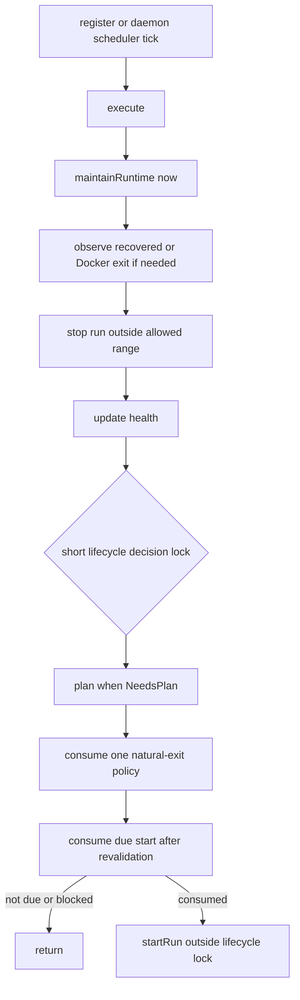

# ADR 0008 — Application Scheduling Semantics

## Status

Accepted — implemented.

This ADR defines the user-visible scheduling contract and the daemon decisions that preserve it.
[ADR 0007](0007-application-runstate-driving.md) defines the underlying run-state, process-exit
publication, and start-driving mechanism; this ADR supplements it rather than replacing it. No SDK
field is added by this decision.

## Context

Application scheduling is the composition of several independent concerns:

- an absolute lifetime (`start_time` / `end_time`);
- an optional UTC daily window (`daily_limitation`);
- a continuous, interval, or cron launch pattern;
- enabled/disabled state and application kind;
- start rejection, natural exit, deliberate stop, and per-exit-code behavior;
- native process, recovered process, and Docker-specific completion paths;
- registration, daemon recovery, and the periodic scheduler tick.

These concerns must produce one predictable answer to two questions: whether an existing run may
continue now, and when a new run may start. They must also avoid duplicate starts, cumulative
schedule drift, restart after deliberate stop, and process creation from a shared timer callback.

## Decision

### 1. Scheduling applies only to managed applications

| Application kind | Main-loop managed | Persisted | Start semantics |
| --- | --- | --- | --- |
| `Managed` | Yes | Yes | Planned and consumed by the scheduler |
| `SystemAgent` | Yes | No | Same scheduler path, with agent-specific restart setup |
| `OneShot` | No | No | `run` starts immediately on the REST worker path |

The on-demand `run` API is intentionally separate from managed scheduling. It does not wait for a
configured schedule occurrence, it is accepted only for `OneShot`, and Docker applications do not
support this API. A managed application's normal first launch, recurring launch, and restart all use
the scheduler path.

### 2. User-visible configuration contract

| Field | Meaning and accepted form |
| --- | --- |
| `status` | `ENABLED` permits planning and starting; `DISABLED` cancels the plan and immediately stops current and buffered runs |
| `start_time` | Unix epoch seconds; inclusive absolute lower bound |
| `end_time` | Unix epoch seconds; exclusive absolute upper bound |
| `daily_limitation.daily_start` | UTC seconds since midnight, or a compatible epoch-seconds value normalized by the server |
| `daily_limitation.daily_end` | Same representation as `daily_start`; both endpoints are required together |
| `start_interval_seconds` | Presence selects recurring scheduling; accepts integer seconds, numeric text, or a supported ISO-8601 duration |
| `cron` | When true, `start_interval_seconds` is interpreted as a cron expression instead of a duration |
| `behavior.exit` | Default natural-exit action: `standby`, `restart`, `keepalive`, or `remove` |
| `behavior.control` | Per-exit-code action overrides `behavior.exit` |
| `retention` | Delay for `remove`; for recurring replacement, time allowed for the preceding run to finish before termination |

Explicit disable or application deletion bypasses retention and stops any buffered run immediately.
Each application keeps at most one buffered run; a later replacement stops the preceding buffer first.

The wire representation remains unchanged. In particular, internal plan state is not exposed as a
new SDK field. Existing read-only fields such as `next_start_time`, `starts`, process timestamps, and
exit information remain the observation surface.

### 3. Time model and boundaries

The effective allowed time is the intersection of the absolute range and the daily range:

```text
allowed(t) = enabled
          && start_time <= t < end_time
          && daily_window_contains(UTC_time_of_day(t))
```

The absolute range and every non-equal daily range are half-open; equal daily endpoints are the
explicit full-day form. Therefore:

- `start_time` is a valid start instant;
- `end_time` is not a valid start or continuation instant;
- `start_time == end_time` is accepted by parsing but represents an empty absolute range;
- an omitted `end_time` means no absolute upper bound;
- an omitted `start_time` lets a continuous app start immediately;
- a recurring app without `start_time` receives an initial anchor approximately one second after
  registration, and that derived anchor is serialized with the application.

`available(now)` deliberately checks only enabled status and absolute expiry. It does not reject an
application merely because `start_time` or the next daily opening is still in the future. This lets
early registration create a future plan immediately. `AppTimer` performs the actual lower-bound and
daily-window calculation, while `consumeScheduledStart` revalidates the complete range at launch time.

#### Daily range forms

| Relationship | Allowed UTC time of day |
| --- | --- |
| `daily_start < daily_end` | `[daily_start, daily_end)` |
| `daily_start > daily_end` | `[daily_start, 24h) ∪ [0, daily_end)` (crosses UTC midnight) |
| `daily_start == daily_end` | Full day |

The server normalizes both endpoints modulo 86,400. This preserves compatibility with clients that
send UTC seconds-of-day and SDKs that send `datetime.timestamp()` epoch seconds. The daily rule is an
hour/minute/second rule only; it carries no calendar-date meaning. Time-zone conversion belongs at
the client/CLI boundary before the value reaches this UTC representation.

For an ordinary non-overnight window, a candidate at or after `daily_end` advances by
`24h - current_time_of_day + daily_start`. This avoids the historical signed-offset error that could
advance by more than a day. A candidate exactly at `daily_end` is outside the range.

### 4. Schedule kinds

#### Continuous

A continuous application has no `start_interval_seconds`. `nextTime(from)` returns the earliest
allowed time at or after `from`. After a natural exit it remains stopped by default; `restart` or
`keepalive` behavior can plan another start.

Crash-loop backoff applies only to continuous applications:

- consecutive runs shorter than 60 seconds delay the next retry by 1, 2, 4, ... seconds, capped at
  300 seconds;
- a run lasting at least 60 seconds resets the backoff and permits an immediate policy restart.

#### Interval

An interval schedule is anchored at its configured `start_time`, including the server-derived anchor
when the client omitted it. Future occurrences stay on that grid. A late scheduler tick may delay the
actual launch, but the actual launch time does not become the next grid origin, so lateness does not
accumulate as schedule drift.

Non-positive parsed intervals retain the existing compatibility behavior: the server logs a warning
and falls back to seven days. Invalid duration syntax is rejected while parsing the application.

#### Cron

When `cron` is true, the raw `start_interval_seconds` value is parsed by `croncpp` and validated while
the application is created. The current accepted syntax includes the existing six-field expressions
with seconds. Each plan asks the cron expression for its next occurrence and remains bounded by the
same absolute and daily ranges.

#### Daily adjustment of recurring occurrences

For compatibility, daily limitation is an adjustment rule, not a strict set-intersection search over
all interval/cron occurrences. The timer first computes an occurrence from the interval anchor or cron
expression and only then adjusts it to the next daily opening when necessary. The opening itself can
therefore be the launch time even when it is not an exact interval-grid or cron occurrence. Subsequent
interval calculations remain anchored at `start_time`, and cron calculations continue from the
expression, so this adjustment does not redefine the base schedule.

Changing this to discard every out-of-window occurrence would be a user-visible semantic change and
requires a separate ADR.

### 5. Plan state and scheduler ownership

Scheduling uses private intent rather than interpreting a missing timestamp as several different
meanings:

| Intent | Meaning |
| --- | --- |
| `NeedsPlan` | Recompute the next occurrence from the immutable user definition |
| `Armed` | `nextLaunch` contains the planned due time |
| `Dormant` | No launch is currently requested |

```mermaid
stateDiagram-v2
    [*] --> NeedsPlan: managed registration / enable / dead recovery
    NeedsPlan --> Armed: nextTime returns an occurrence
    NeedsPlan --> Dormant: nextTime has no future occurrence
    Armed --> Armed: not due, or current process is not safely replaceable
    Armed --> Armed: due outside range; replan finds a later occurrence
    Armed --> Dormant: due outside range; replan is exhausted
    Armed --> Dormant: due occurrence consumed
    Dormant --> NeedsPlan: enable or another explicit replan trigger
    Dormant --> Armed: keepalive or successful Docker pull
    Armed --> Dormant: disable / destroy / remove policy
```



`scheduleStartAt` is record-only: it writes `nextLaunch` and `Armed`. It neither sleeps nor registers
a process-start timer. The daemon main loop owns due-start consumption and calls `startRun` only after the
scheduling decision lock is released.

The daemon's `ScheduleIntervalSeconds` is constrained to 1–100 seconds and defaults to 2 seconds.
Consequently, a due launch normally has up to one scheduler-tick of dispatch delay; system load or a
blocking backend may add more. `next_start_time` is a planned time, not a guarantee of exact dispatch
at that instant. On-demand `run` is unaffected because it starts immediately on its request path.

### 6. Registration and tick flow

`Configuration::addApp` binds the new definition and invokes `execute()` immediately. Early
registration therefore plans `start_time` or the next daily opening without waiting for the first
periodic daemon pass. Later passes converge all managed applications through the same flow:



The decision order is intentional:

1. reconcile process completion first;
2. stop a run that may no longer continue;
3. plan a legal future occurrence;
4. apply a natural-exit action exactly once;
5. revalidate and consume at most one start;
6. perform backend start outside the decision lock.

If registration occurs before `start_time`, the immediate pass arms `start_time`. If it occurs before
a daily opening, the pass arms that opening. If the absolute range and the next daily opening do not
overlap, no start is armed. A scheduler tick that arrives after an armed time rechecks the current
instant; it never starts an application after `end_time` or in a closed daily window.

### 7. Running-process enforcement

Scheduling governs both starting and continuation:

- an enabled run continues only while it remains inside the absolute and daily ranges;
- reaching `end_time` stops it and prevents another start;
- reaching `daily_end` stops it, preserves the schedule definition, and plans the next daily opening
  when one still exists before `end_time`;
- disabling stops it and cancels both an armed launch and pending natural-exit evaluation;
- enabling changes the intent to `NeedsPlan`, so the next legal occurrence is recomputed;
- destruction/removal makes the application unavailable and cannot mint a restart.

For continuous applications, the process gate prevents a due restart from replacing a start or run
that is still active. A recurring occurrence deliberately replaces the current run, preserving the
established periodic behavior once the current run has been accepted and its exit has not been
observed. `Starting` and `Finalizing` runs still block a new start. With positive `retention`, each
preceding run receives that much time to finish before termination; with zero retention it is
terminated immediately. The new run is always the only current run exposed by application state.
Run identity ensures a buffered process exit cannot drive policy for the current run.

Stops caused by disable, range closure, replacement, timeout, or destruction are deliberate exits.
They may finalize process state and publish an exit, but they do not invoke natural-exit behavior.

### 8. Start acceptance and failure

All backends return a `ProcessStartResult`; start rejection is normal control flow rather than an
exception-driven backend contract.

An accepted start:

- publishes the run PID and `Running` phase before it is observable as runnable;
- increments `starts` only after acceptance;
- emits the existing process-start event;
- for interval/cron, pre-arms the next occurrence from at least the following second, preventing a
  same-second duplicate calculation.

A rejected start has no process-exit callback. It records a completed failed attempt, completes any
waiting request, and follows these rules:

| Path | Result |
| --- | --- |
| Managed continuous | Replan through the timer after continuous crash-loop backoff |
| Managed interval/cron | Replan from one second later; the timer then selects the next legal occurrence |
| On-demand `run` | Cancel scheduling and return the start error to the API caller |

Retries always return through `scheduleNext`, so they cannot bypass `start_time`, `end_time`, or the
daily window. Unexpected invariant failures remain fatal/logged failures rather than adding speculative
recovery branches to the scheduling state machine.

### 9. Natural exit actions

Only a genuine natural exit of the current run sets the one-shot restart-evaluation latch. Run identity
prevents a buffered or otherwise non-current process from scheduling work for the current run.
Per-code behavior is selected first; otherwise `behavior.exit` applies. The default is `standby`.

| Action | Scheduling result |
| --- | --- |
| `standby` | No exit-driven plan. Continuous stays stopped; interval/cron retains the next occurrence already armed on accepted start |
| `restart` | Call `scheduleNext(now + backoff)` and therefore honor the configured pattern and all time ranges |
| `keepalive` | Arm `now + backoff` directly, bypassing interval/cron occurrence calculation; due-time consumption still enforces enabled status and all time ranges |
| `remove` | Cancel any pre-armed recurring start, then schedule application deletion after `retention` |

The latch is consumed once. In particular, `remove` is not re-registered on each scheduler tick, so a
retention longer than the scheduler interval still leads to removal.

### 10. Recovery and Docker scheduling

Recovered processes and attached Docker containers are not reactor-managed child processes. The main
loop therefore checks their process identity and reports disappearance through the same current-run
exit path. A Docker image pull is a reactor-managed native child, so its exact `ProcessManager` callback
remains the sole exit-code authority.

- attaching to a live recovered process sets scheduling to `Dormant`, preventing a duplicate start;
- attaching to a dead or reused PID requests a new plan;
- a recovered non-child has no reliable wait status, so its compatible synthesized exit code is 0;
- Docker running-container exit is detected by host-PID identity and inspected outside application
  scheduling locks for the best available exit code;
- an image pull is represented as its own accepted process/run;
- a successful pull with no container ID is an intermediate completion: it directly arms the
  container start and does not consume ordinary exit behavior;
- a pull failure follows the configured natural-exit behavior;
- very short-lived containers still pass through start acceptance before exit finalization, preserving
  START-before-EXIT publication as defined by [ADR 0007](0007-application-runstate-driving.md).

### 11. Concurrency and timer boundaries

The scheduling design follows these invariants:

- `Runtime::lifecycleMutex` serializes the tick's plan/restart/due-consume decision and the atomic
  enable/disable transition; an internal lifecycle generation invalidates a consumed start or natural-exit
  decision when disable/enable intervenes; asynchronous process publications update the run snapshot
  under `runMutex`, and due-start consumption always revalidates their result;
- composite run data and `nextLaunch` are read/written as a snapshot under `runMutex`;
- process-slot access uses the non-recursive `m_process` gate;
- backend start, terminate, Docker inspection, OS inspection, event callbacks, and HTTP completion
  callbacks execute outside the scheduling decision lock;
- a process slot is reserved under the process gate, but start occurs only after all scheduling locks are
  released;
- no scheduled fork/exec occurs on the shared `TimerManager` thread;
- Docker CLI termination launches a separately managed cleanup child with a short timeout and never
  waits for that child on the shared timer thread;
- `TimerManager` remains appropriate for delayed termination, removal, stdout coalescing, and exit
  finalization, not for scheduled process creation.

The lock order and process-exit finalization mechanics are owned by
[ADR 0007](0007-application-runstate-driving.md). This ADR relies on their exactly-once current-run
publication and does not add another scheduler lock or worker thread.

### 12. Persistence and observability

The persisted application definition keeps the existing values:

- absolute `start_time` and `end_time`;
- normalized daily endpoints;
- the raw interval/duration or cron expression and `cron` flag;
- behavior and retention;
- enabled/disabled status.

`next_start_time` is emitted only while a launch is armed. `Dormant` and `NeedsPlan` are private daemon
details and are not serialized or added to any SDK. `starts` counts accepted starts, not rejected start
attempts. Definition replacement, daemon reload, enable, and dead recovery rebuild the private plan
from the persisted definition; a live recovered attachment deliberately suppresses planning.

## Historical migration

| Version | Start driving | Scheduling/exit state | Result |
| --- | --- | --- | --- |
| Before `6e47f120` | `execute` separately performed stop, schedule, refresh, and exit-policy work; `scheduleNext` registered a `TimerManager` start callback | A missing next-launch pointer and several process timestamps carried multiple meanings | Process start ran on the shared timer thread; exit policy could be re-evaluated by polling |
| `6e47f120` | `driveLifecycle` moved due-start consumption into the daemon tick | Added a one-shot exit latch and explicit schedule-needed state | Removed timer-callback start, temporarily blocked recurring replacement, and held the lifecycle lock across more process/backend work than necessary |
| Current | `execute` converges once through `maintainRuntime`; the tick plans, consumes one exit decision and one due start, then starts outside the lock | `NeedsPlan / Armed / Dormant` plus current-run identity | Restores recurring replacement and retention buffering without timer-thread starts; no repeated exhausted-plan calculation or backend work under the decision lock |

The historical `refresh` responsibility was not narrowed to exit polling. Stop enforcement, future
planning, restart policy, and due-start triggering all remain part of the main-loop convergence point,
leaving room for additional runtime maintenance without restoring several loosely ordered helpers.

## Compatibility decisions

- Keep both daily wire forms and normalize in `DailyLimitation::FromJson`; do not require SDK changes.
- Keep the existing daily-opening adjustment for interval/cron rather than adopting strict occurrence
  filtering.
- Keep interval grids anchored at `start_time` and cron expressions source-based; do not anchor either
  to scheduler dispatch time.
- Keep recurring replacement and its per-run retention handoff; do not defer a due occurrence merely
  because the preceding run is still active.
- Keep the seven-day fallback for a parsed non-positive interval until a separately versioned input
  validation change is agreed.
- Keep on-demand `run` separate from managed scheduling and do not expose private scheduling intent.

## Alternatives rejected

### Timer callback starts

Registering one `TimerManager` callback per start makes fork/exec share the timer thread with process
cleanup, removal, stdout, and health work. Record-and-consume scheduling is simpler and isolates backend
latency from timer dispatch.

### Per-application polling loops or sleeps

They add threads, duplicate wake-up state, and create new lock/lifetime problems. The existing daemon
tick is the single managed scheduler and is sufficient for the supported timing precision.

### Recompute an exhausted schedule every tick

An immutable definition with no future occurrence cannot produce a different answer on the next tick.
`Dormant` avoids repeated empty work; explicit changes such as enable, replacement, or dead recovery
request a new plan.

### Add SDK-visible scheduling state

`NeedsPlan`, `Armed`, restart latches, and run phases are implementation state. Existing definition and
runtime fields already answer user questions without committing SDKs to daemon internals.

## Consequences

### Positive

- early registration, combined absolute/daily ranges, and daily close/reopen have one calculation path;
- interval schedules do not drift with scheduler lateness;
- recurring replacement preserves the configured retention handoff for the preceding process;
- start rejection, natural exit, and deliberate stop are distinct and cannot accidentally share retry
  behavior;
- recurring `standby` and `remove` behavior are unambiguous despite pre-arming;
- Docker pull/container and recovered-process completion reuse the same plan and policy invariants;
- process start never blocks the shared timer callback thread;
- no new SDK parameter or server/client version negotiation is required.

### Trade-offs

- scheduled starts are tick-granular rather than exact timer callbacks;
- daily adjustment can launch at daily opening even if that instant is not an exact cron/interval
  occurrence;
- `keepalive` intentionally bypasses the recurring pattern before final time-range validation;
- recovered non-child exit status cannot be exact on platforms without a child wait status;
- the legacy seven-day interval fallback is less strict than rejecting all non-positive values.

## Verification contract

The SDK-level lifecycle verifier is expected to cover these scheduling cases:

| Case | Scheduling behavior covered |
| --- | --- |
| `start_failure_recovery` | managed rejection, replan, and accepted-start accounting |
| `disable_enable` | cancel/forced stop, no exit-policy restart, and explicit replan |
| `lifecycle_generation` | rapid disable-enable ABA with stale start/exit/replan isolation |
| `natural_restart` | natural-exit latch, behavior, and continuous backoff |
| `exit_behavior_matrix` | native standby, keepalive, and exit-code-specific restart override |
| `periodic` | integer, numeric-text, ISO-8601, and six-field cron plan/consume/re-arm |
| `interval_anchor` | future initial occurrence, strict-next semantics, and a drift-free fixed grid |
| `valid_time_window` | early registration, absolute range, daily intersection, and expired-occurrence suppression |
| `daily_range_shapes` | server-side ordinary, overnight, and full-day membership plus next-opening calculation |
| `daily_limitation` | close/stop/reopen and SDK epoch normalization |
| `daily_recurring` | interval and cron occurrence calculation before daily-opening adjustment |
| `recurring_retention_buffer` | a due occurrence replaces a still-running current run with positive retention configured |
| `remove_after_exit` | cancellation of a recurring pre-arm and one-shot retention removal |
| `stop_start_race` | concurrent status changes, process gate, and lifecycle decision serialization |
| `attach_recovery` | live attach suppression and dead/reused-PID replanning |
| `docker_fast_exit` / `docker_image_pull` / `docker_forced_stop` | pull/container exit observation and deliberate stop, run once per CLI/API daemon profile |

These are integration scenarios against a separately running daemon. Writing or reviewing this ADR
does not authorize executing the verifier, a C++ binary, or C++ unit tests.

## Deferred

- Change daily limitation from opening-adjustment semantics to strict occurrence filtering only through
  a versioned user-visible decision.
- Introduce a scheduler wake-up condition only if sub-tick launch latency becomes a requirement.
- Split broader `Application` responsibilities without exposing scheduler internals in its public header.
