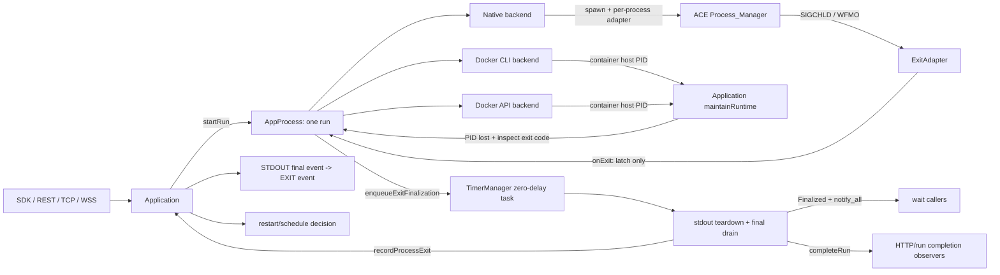
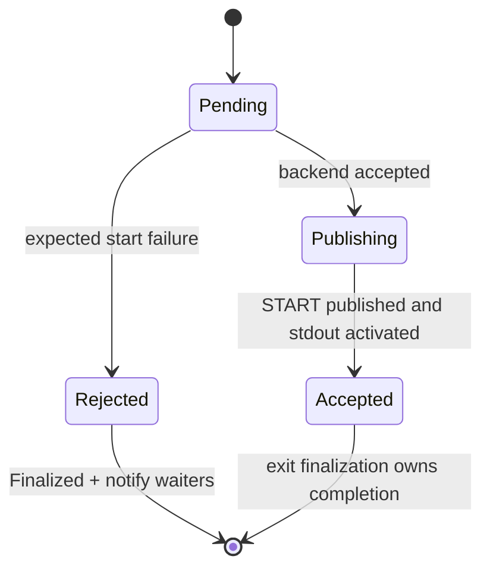
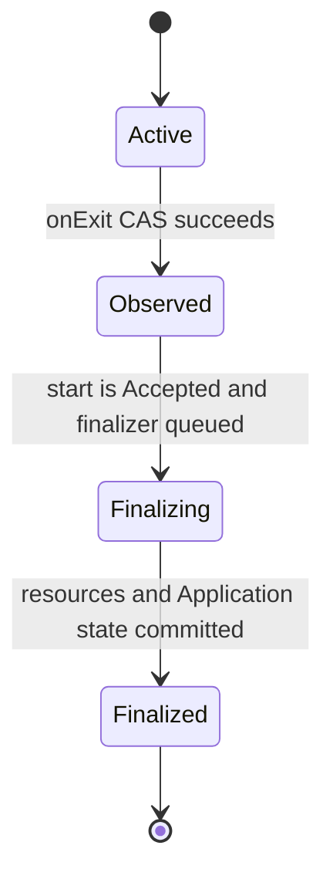
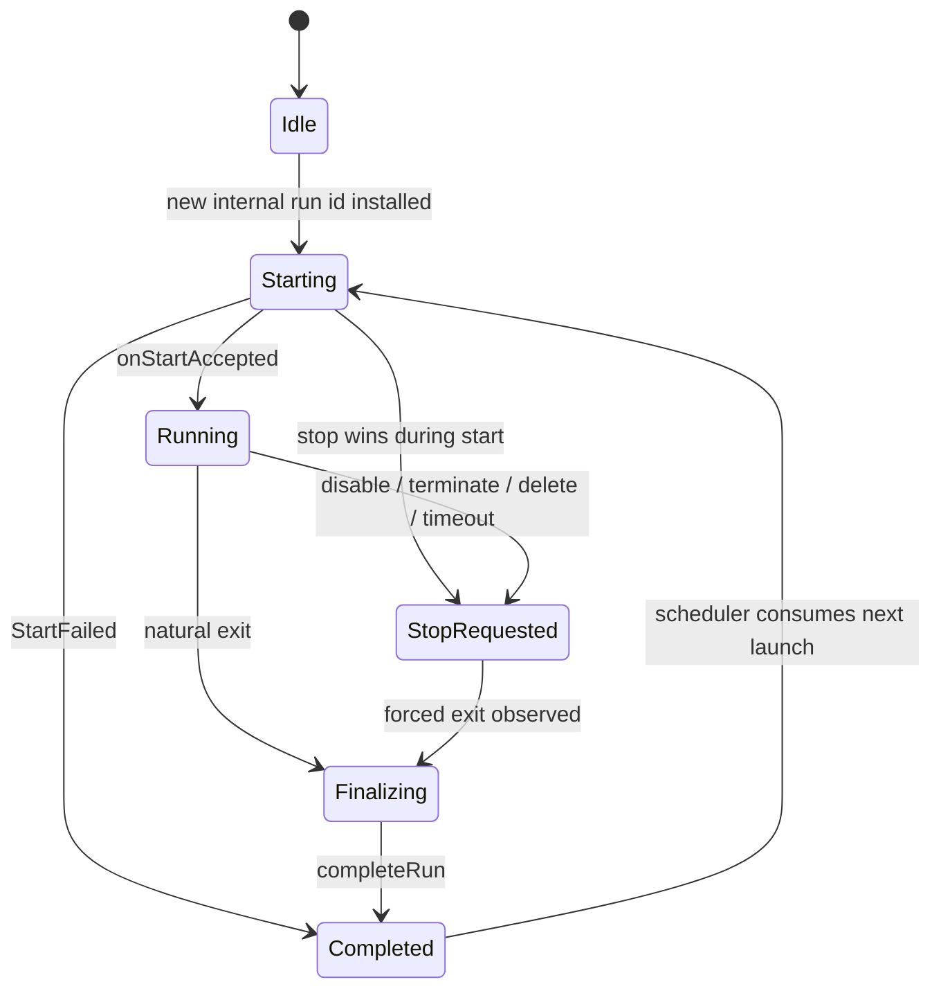
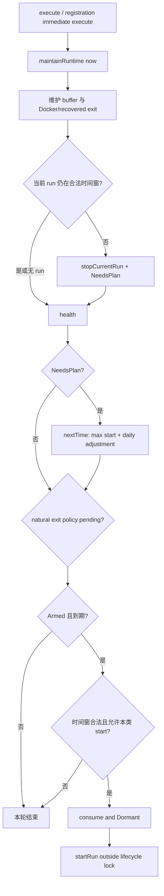

# 进程生命周期重构：设计、改动与验证记录

## 文档状态

- 记录日期：2026-08-15
- 对比基线：当前工作树相对 `HEAD` 的全部相关改动
- 范围：进程启动、启动失败、自然退出、主动终止、极短进程、stdout、退出回调、等待、重启、Docker CLI/API、HTTP 长轮询、事件、SDK 与批量验证程序
- 当前结论：静态编译和链接通过，LSP/CodeGraph/`otool`/脚本语法检查通过；按照明确约束，没有执行任何项目 C++ binary、C++ UT 或 Python 集成 workload

## 一、目标与最终结果

这次改动的核心不是增加更多退出分支，而是把原来分散在 `Application`、`AppProcess`、`MonitoredProcess`、`HttpRequest`、Docker helper 和轮询代码中的生命周期判断收敛为两层状态机：

1. `AppProcess` 只负责一次具体 run 的启动发布、退出观察、资源清理和完成通知。
2. `Application` 只负责业务 run 状态、用户可见结果和下一次启动策略。

最终行为如下：

| 场景 | 最终判断方式 | 用户可见结果 |
|---|---|---|
| 命令校验或 spawn 失败 | `ProcessStartResult.accepted == false` | 没有 live PID、不增加 accepted-start count，并保留 `last_error` |
| 正常自然退出 | `Process_Manager` → `ExitAdapter` → `AppProcess::onExit` | 原有 `return_code`、`last_exit_time` 与 EXIT payload 保留精确 exit code |
| `terminate`/超时/disable/delete | 先标记 `terminating`，后端停止后合成 `onExit(9)`；disable/delete 同时终止 current 与 buffer；CAS 与自然退出去重 | 原有 status/PID/exit time 收敛；不新增 SDK 或事件字段 |
| 启动后立即退出 | 启动发布门控保存退出，先发布 START/激活 stdout，再完成 EXIT | 不丢退出，不发生 EXIT 早于 START |
| Docker 在 inspect PID 前已退出 | inspect 同时读取 `Running` 与 `ExitCode`，通过 `reportEarlyExit` 接受后立即完成 | 保留真实容器 exit code，即使从未得到 host PID |
| daemon 恢复后附着的非子进程消失 | PID + OS start token 检查，scheduler polling 发现丢失 | 更新原有 exit time；非子进程无法取得真实 wait status，兼容 exit code 为 0 |

这次也明确了 `wait` 的语义：它等待的是 AppMesh 的一次 run 完成收口，而不是再次承担 OS 子进程回收。完成条件包括 stdout teardown/final drain 和 `Application` 退出状态提交，因此不再使用 10ms sleep loop。

## 二、整体关系图



`Process_Manager` 的 dedicated reactor 和进程表仍然负责 OS 层面的退出检测与回收。新增的 AppMesh 状态机没有替代它，而是把“OS 已退出”和“业务 run 已完成”分开。

## 三、两层状态机

### 3.1 `AppProcess` 启动状态



- `Pending`：后端还没有给出本次 run 是否被接受。
- `Publishing`：后端已经接受；正在将 run 发布给 `Application`。
- `Accepted`：START 已发布，stdout 已激活，退出现在可以收口。
- `Rejected`：没有形成有效进程 run。直接终结等待者，不伪造 PROCESS_EXIT。

### 3.2 `AppProcess` 退出状态



`Active -> Observed` 是唯一的退出认领点。自然退出、主动终止、Docker polling、恢复进程 polling 即使同时到达，也只有一个路径能通过 CAS。

### 3.3 `Application` run 状态



终止原因不再单独保存成仅供 API 输出的枚举；业务判断只保留 exit code、是否为自然退出和一次性 restart-evaluation latch。调度意图独立记录为 `Dormant`、`NeedsPlan`、`Armed`，避免以前 `m_needsSchedule`、next time 和 exit latch 各自表达部分事实。

## 四、启动流程

### 4.1 统一入口

托管应用与 on-demand 应用都经过 `Application::startRun`：

1. 在 `m_process` gate 下创建新的 `AppProcess`，并先安装新的内部 run id 与 `Starting` 快照。
2. 释放 gate 后终止旧进程；buffer 模式则给旧进程设置延迟终止。
3. 如果是同步 run API，按内部 run id 注册一次 run completion callback。
4. 调用统一的 `AppProcess::start`。
5. `AppProcess::start` 调用后端 `startImpl`，再统一执行 `resolveStart`。
6. 接受成功后设置 lifecycle timeout 和 stdout 文件检查；失败则进入 `recordStartFailure`。

以前的 `spawnNow`、`runApp`、`MonitoredProcess` 分支已被这一条路径取代。START 计数也只在 `onStartAccepted` 增加，不再把对象分配、恢复失败或被拒绝的尝试算成成功启动。

### 4.2 `startImpl` 的错误契约

预期的运行时错误不依赖异常控制流：

- 命令不存在或不可执行；
- 用户无效；
- working directory 无效；
- spawn 失败；
- cgroup 建立失败；
- Docker CLI/API 返回错误；
- Docker JSON 缺字段或类型错误。

这些情况通过 `ACE_INVALID_PID` 与 `startError` 返回，公共结果统一为：

```cpp
struct ProcessStartResult
{
    bool accepted;
    pid_t pid;
    std::string error;
};
```

`startImpl` 没有声明成 `noexcept`：内存分配或底层库违反契约等不可恢复异常仍可能存在，但不为这些罕见情况在每层堆叠 `try/catch`。用户输入/API 使用错误仍由 `Application` 层抛出，例如对 managed app 调用 on-demand run，或 on-demand Docker run 不被支持。

### 4.3 启动失败

启动失败与进程退出是两个不同事实：

- 启动失败没有已接受的 OS run，因此不发送假的 EXIT 事件。
- `resolveStart(false)` 将 `AppProcess` 标记为 `Rejected/Finalized` 并唤醒等待者。
- `Application::recordStartFailure` 将对应 run 标记为 `Completed`，写入 `last_error`，更新 health，并完成 run observers。
- on-demand API 将失败转换为用户可见错误。
- managed continuous app 会按 restart backoff 规划下一次尝试；interval/cron app 按自己的 schedule 规划。内部 run id 仍会隔离失败尝试和后续恢复，但不作为新的 Application SDK 字段暴露。

## 五、极短进程为什么不会丢退出

原生进程即使在 fork/exec 后立刻退出，也按以下顺序收敛：

```mermaid
sequenceDiagram
    participant A as Application
    participant P as AppProcess
    participant M as Process_Manager
    participant R as Process reactor
    participant T as TimerManager

    A->>P: start()
    P->>M: spawn(process, ExitAdapter)
    Note over P,M: hold Process_Manager mutex
    M-->>P: pid; adapter registered
    P->>P: publish pid + lastPid + OS start token
    P->>M: release mutex
    R->>M: handle SIGCHLD / exit
    M->>P: ExitAdapter::handle_exit(code)
    P->>P: Active -> Observed; store code
    Note over P: StartPhase may still be Pending/Publishing,
    so finalization is not queued yet
    P->>A: onStartAccepted(runId, pid)
    A->>A: publish Running + START
    P->>P: activate stdout
    P->>P: StartPhase = Accepted
    P->>T: enqueueExitFinalization(code)
    T->>P: finalizeExit(code)
    P->>A: final stdout + EXIT state/event
    P->>P: Finalized + notify_all
```

这里有两个关键门：

1. spawn 注册 adapter、PID 发布和 process reactor 的退出处理共用 `Process_Manager` mutex，因此 callback 不会在 adapter/PID 尚未登记时抢先进入。
2. 即使 callback 在 `resolveStart` 之前到达，`onExit` 只保存 `Observed`；`resolveStart` 完成 START 与 stdout 激活后会再次调用 `enqueueExitFinalization`。

因此顺序保证为：`START -> STDOUT* -> EXIT`，而不是靠 sleep 猜测启动是否完成。

## 六、退出处理为什么保留两步

最终保留的两个名字是：

- `enqueueExitFinalization`：把已经观察到的退出移出 `Process_Manager` upcall。
- `finalizeExit`：真正执行资源、状态与 observer 的收口。

旧的 `deferFinishExit`、`scheduleExitFinalization`、`continueAfterExit`、`beginExit` 都已删除。两步不是业务状态复杂化，而是一个必要的锁边界：`ExitAdapter::handle_exit` 可能运行在 `Process_Manager` mutex 内，不能在这个栈上 teardown stdout、调用 `Application`、发送事件或重新进入 process manager。

`finalizeExit` 的固定顺序是：

1. 取消 stdout/terminate timers。
2. 从 `AppProcess` 中移出 stdout strategy，在 `m_processMutex` 外 teardown 并 final drain。
3. `Application::recordProcessExit` 提交 exit code、health、task 与重启 latch。
4. 补发剩余 STDOUT，并发送 EXIT。
5. 将 `AppProcess` 设为 `Finalized`，`completionCv.notify_all()`。
6. `Application::completeRun` 将 run 设为 `Completed`，然后在锁外调用 completion callbacks。

第 5 步早于 completion callback，避免 callback 自己间接等待同一个 run 时形成自等待。异常捕获只保留在必须继续推进状态机的最终收口边界；这些异常会记录 `FATAL`，不会被当作普通业务分支继续细分。

## 七、`wait` 的历史、语义与当前实现

### 7.1 历史变化

| 版本 | timed wait | 无期限 wait |
|---|---|---|
| `9d8f8576`（引入 `ACE_Process_Manager`） | 每 10ms 调一次 PM zero-time wait，再 sleep | 直接调用 PM blocking wait |
| `800d8b05` | 仍是 10ms polling | 改成无限 10ms PM zero-time wait loop |
| 本次改动 | `condition_variable::wait_for`，谓词为 AppMesh `Finalized` | 删除无界 overload，调用方必须给出明确 timeout |

### 7.2 为什么 public `AppProcess::wait` 不再调用 `Process_Manager::wait`

ACE 允许在 reactor 存在时调用 `Process_Manager::wait`；本次不是因为 API 禁止，而是因为职责和完成语义不同：

- `Process_Manager`/reactor/`ExitAdapter` 已经负责 OS exit detection 和 child reaping。
- PM wait 返回的是“OS 子进程已结束/已回收”。
- AppMesh 的调用方需要的是“stdout 已 drain、Application exit 状态与事件已提交、run 可以读取最终结果”。
- 再从 public wait 调 PM wait，会形成第二个竞争的 reaper/回调路径；旧实现还引入固定 10ms 延迟和无期限 polling。

当前实现只等待 `completionCv`：

- `tv == 0`：纯非阻塞完成检查。
- `tv > 0`：一次 `wait_for`，没有 loop，没有 sleep。
- 完成时写入 `status` 并返回 `lastPid`。
- timeout 返回 `0`。
- Docker 极短退出等从未暴露 host PID 的已完成 run 返回 `ACE_INVALID_PID`；这不表示等待失败，完成状态应由 `isFinalized`/exit result 判断。

当前 `Process_Manager::wait(pid)` 只在 native terminate 的罕见 fallback 分支中保留，用于后端已经选择 PM terminate 后的 OS 回收；它不是 public completion wait。

### 7.3 是否能抓到 exit 事件

可以，入口没有依赖 waiter：

- 原生子进程：dedicated process reactor 主动触发 `ExitAdapter`。
- `terminate`：后端停止后合成 `onExit(9)`。
- Docker/recovered attach：`Application::maintainRuntime` 发现 host PID 不再匹配后触发 `onExit`。
- Docker inspect 前已退出：启动流程自身调用 `reportEarlyExit`。

`wait` 是被通知者，不是退出检测器。因此没有调用 `wait` 的 run 也会正常完成、发事件和重启。

## 八、主动终止与竞态

主动终止采用以下规则：

1. `terminate()` 先设置 `terminating=true`。
2. native 后端在 `m_processMutex` 下与 `startImpl` 串行，避免 stop 正好落在 spawn 与 PID 发布之间而漏杀。
3. 使用 PID + OS process start token 验证仍是同一个进程，同时排除 zombie，避免 PID reuse 误杀。
4. 终止 process group；从 PM 移除并按需要回收 child。
5. 合成 exit code 9。
6. 若自然退出 callback 同时到达，`Active -> Observed` CAS 只允许一个路径继续。

如果 stop 在 start 尚未发布时先到达，`terminating` 会被记住；只要后端最终接受，`AppProcess::start` 会立即执行 `terminateImpl` 并完成 forced exit。`Application` 的 run phase 同时从 `Starting/Running` 进入 `StopRequested`，所以不会把这个退出误判为自然 crash/restart。

## 九、stdout 与事件顺序

### 9.1 strategy 生命周期

- POSIX 使用 `PipeStdoutStrategy`/`StdoutPump`。
- Windows 使用 `TimerStdoutStrategy`。
- 无可用输出源时使用 null strategy。

strategy 可以在 spawn 后构造，但只能在 `onStartAccepted` 发布 START 后 `activate`。teardown 时先从 reactor/timer 注销，再等待可能正在执行的 dispatch，执行同步 final drain，最后释放 fd/handle。

stdout 文件 mutex 从 recursive mutex 收缩为普通 `std::mutex`，并由 `shared_ptr` 保证它比 `AppProcess`/pump 中任意一个析构顺序都更长。

### 9.2 事件数据

| Event | 数据 |
|---|---|
| START | `pid`, `process_uuid` |
| STDOUT | `output`, `position`, `finished` |
| EXIT | `exit_code`, `pid`, `last_error` |

finalization 会先 teardown strategy，拿到已经 dispatch 的 byte position，再从该位置读到文件 EOF，补发 `finished=true` 的最后一段 STDOUT，之后才发送 EXIT。`*` wildcard 订阅也会被 `hasStdoutSubscriber` 识别。

`EventDispatcher` 只在短临界区内维护索引和复制 callback，真正的网络/用户 callback 在 mutex 外执行；失败订阅再通过第二个短临界区删除。因此不再需要 recursive mutex，也不会拿 dispatcher 锁进入 transport。

## 十、Docker CLI 与 API

### 10.1 共同规则

- image pull 是当前 `DockerProcess` 自己管理的一次 native `AppProcess` run，不再由另一个零散的 `m_imagePull` 对象代管。
- pull 拥有正常 PID、ExitAdapter、timeout、stdout 和 completion；Application 启动请求不等待整个 pull 完成。
- pull 成功且还没有 container ID 时，被识别为中间 run，立即 arm 下一次 container start；不会依赖用户的 exit behavior 才继续。
- running container 不是 daemon 的 child，运行期由 `Application::maintainRuntime` 检查 host PID identity；丢失后 inspect 获取准确 exit code。
- 容器不由 Docker 自动重启，避免与 AppMesh restart policy 形成两个控制器。

“pull 不阻塞”专指耗时 image pull 不占住 Application 启动调用。CLI 的 `rm/image inspect/run/inspect/logs` 和 API control request 仍是同步但有明确 timeout 的短控制操作；当前没有把整个 Docker 控制面改成异步状态机。

### 10.2 Docker CLI

`runDockerCli` 统一负责临时 CLI 子进程：

1. 创建普通 `AppProcess`。
2. 通过统一 `start` 获得 `ProcessStartResult`。
3. 设置 timeout。
4. 用 CV completion wait 等待，不再用无期限 wait/sleep loop。
5. timeout 时 terminate 并做一次有界 completion wait。
6. 读取输出并清理唯一临时文件。

数字解析使用 `std::from_chars`，不依赖 `isNumber + stoi/stoll` 的异常路径。container start 后 inspect 一次读取 `Pid Running ExitCode`：

- `Running=true && Pid>1`：attach host PID。
- `Running=false`：调用 `reportEarlyExit(exitCode)`。
- 其他情况：记录明确 `startError` 并清理 container。

没有使用 `--rm`，确保退出后仍能 inspect exit code 和读取最终 logs；下一次 start 或显式 terminate 负责确定性清理。

### 10.3 Docker API

- 直接依赖通用 `RestClient`，不再通过 `HttpRequest`/process callback 建立奇怪耦合。
- `RestClient::request` 增加可选 request timeout override；Docker API 使用 15 秒，其他调用保留原默认值。
- JSON 使用已有 `HAS_JSON_FIELD`、`GET_JSON_*` 宏，配合必要的 object/string/integer/boolean 类型检查；`nlohmann::json::parse(..., false)` 用 discarded value 表达解析失败，不新增通用 JSON helper，也不为普通 parse error 加 try/catch。
- metadata 必须是 object；`HostConfig` 若存在也必须是 object。
- AppMesh 统一覆盖 `Image`、`Cmd`、`WorkingDir`、`Env` 和资源限制。
- 强制 `AutoRemove=false`、`RestartPolicy.Name=no`。
- create response、start response 和 inspect state 都验证结构；inspect 已停止时保存精确 `ExitCode`。
- terminate 顺序为 kill，再 forced delete，最后 detach；404 视为目标已不存在。
- logs 同时支持 Docker multiplexed 8-byte frame 和 TTY unframed stream，并遵守 `maxSize/readLine`。
- request adapter 处保留一个异常归一化边界，将底层 HTTP 异常转换成 `503 + error text`；Docker 启动逻辑本身按 status/error 返回，不再层层 try/catch。

## 十一、Application、HttpRequest 与 task 的边界

### 11.1 `Application` 头文件收缩

`Application.h` 只保留业务 API 和少量按职责分组的 private orchestration method。运行时状态、completion registry、backoff 和相关锁全部隐藏到 `Application.cpp` 的 private `Runtime` pimpl-like 结构中，不再把 `RunState`、锁、模板访问器和一组零散 flag 暴露在类定义里。

`Kind` 统一表达：

- `Managed`
- `OneShot`
- `SystemAgent`

`ScheduleKind` 统一表达 continuous/interval/cron。由此删除了 persistent flag、agent 名字特判和 cron boolean 的交叉组合。`main.cpp` 使用 `isManaged()` 决定 daemon startup 执行；snapshot 只使用 `isPersistAble()`。

### 11.2 HttpRequest 不再依赖 process

以前 `HttpRequest.cpp` 持有全局 PID → request multimap，并由 process exit 静态回调唤醒。现在：

- `HttpRequest.cpp` 不 include `AppProcess.h`。
- 输出长轮询向 `Application` 订阅指定 `process_uuid` 的 completion。
- request 自己负责 timeout、取消订阅和 exactly-once response。
- `Application::runSync` 使用相同的 run-scoped completion registry。
- 删除 `HttpRequestOutputView::onProcessExitResponse` 和全局 `APP_OUT_VIEW_MAP`。

`Application` 仍在 REST/worker 边界接收 `HttpRequest`，因为同步 run reply 和 task channel 本来就是 Application API；进程核心 `AppProcess` 不再知道 HTTP request。

### 11.3 TaskRequest 并发与重启隔离

`TaskRequest` 增加自己的普通 mutex 和当前 `processKey`：

- 新 run 在 START 发布前先 `activate(processKey)`。
- 旧 worker 的 fetch/reply 会被移出状态并在锁外 interrupt。
- fetch/reply 必须匹配当前 process key，避免旧 run 回包污染新 run。
- client task 按 FIFO 排队，active task 在 worker 重启后优先重投。
- 网络 reply、interrupt 和对象析构都在 task mutex 外执行。
- queue 上限保持 512，满时明确返回 service unavailable。

## 十二、重启与调度

调度只记录意图，不在 shared TimerManager 上 fork/exec：

1. `scheduleStartAt` 只写入 `nextLaunch + Armed`。
2. daemon scheduler tick 调用 `maintainRuntime(now)`。
3. `consumeScheduledStart` 在确认 enabled、到期和时间窗后消费计划；continuous restart 仍受
   `blocksStart` 保护，interval/cron 只替换已 accepted 且 exit 尚未被认领的 active run，
   `Starting/Finalizing` 仍阻止新 start。
4. 真正的 `startRun` 在 lifecycle decision lock 外执行。

自然退出才设置 `restartEvaluationPending`；主动 stop 不自动按 crash 处理。`applyExitPolicy` 对 standby/restart/keepalive/remove 只消费一次 latch。

- continuous app 使用 crash-loop exponential backoff；稳定运行后复位。
- interval/cron 已由 schedule 控制间隔，不再叠加 crash-loop backoff。
- Docker pull 成功是中间 run，直接 arm container start。
- system agent 的 PSK 等待保持异步，避免占住单 timer dispatch thread。

### 12.1 全局时间范围与 daily limitation

`start_time/end_time` 是绝对时间范围，daily limitation 在 Server JSON 入口统一归一化为 UTC 日内秒数；两者按交集驱动：

1. 提前注册时，`scheduleNext` 先取 `max(now, start_time)`。
2. `adjustDailyTimeRange` 再把候选时间推进到 daily window 的下一开放点。
3. 候选时间达到或超过 `end_time` 时没有未来 occurrence，schedule 进入 `Dormant`。
4. 到点启动前，`consumeScheduledStart` 再检查绝对范围与 daily window，避免 scheduler 延迟后在失效窗口中误启动。
5. 运行中达到 `end_time` 或离开 daily window，`stopUnavailableRun` 停止当前 run；daily window 之后仍与绝对范围相交时才会重新启动。

daily window 使用半开区间 `[daily_start, daily_end)`；`daily_start > daily_end` 表示跨 UTC 午夜，二者相等表示全天开放。Server 同时兼容已有的日内秒数与 SDK `datetime.timestamp()` 产生的 epoch 秒，统一取 UTC 日内秒数；`AppTimer` 内只做日内 duration 运算。普通窗口结束后的正确偏移为 `24h - now + daily_start`；同时补齐了恰好位于 `daily_end` 的边界。

### 12.2 历史调度驱动对照

| 阶段 | 驱动方式 | 保留的核心判断 | 主要差异 |
|---|---|---|---|
| `6e47f120` 之前 | `execute` 分段调用 stop/schedule/refresh/exit policy，`scheduleNext` 注册 TimerManager timer 并在 callback 中启动 | enabled、绝对 end、daily range、next launch、process running | 启动发生在 shared timer thread；exit 状态依赖多个时间点和 return code 推断 |
| `6e47f120` | `driveLifecycle` 在 daemon tick 中串联相同阶段，`spawnIfDue` 消费 launch | 增加一次性 exit latch、schedule intent 和 process running gate | 不再从 timer callback fork/exec，但 lifecycle lock 覆盖 stop、health 和 spawn，范围过大 |
| 当前 | `execute` 只进入 `maintainRuntime(now)`；它在锁外维护 process/stop/health，锁内只规划、应用一次 exit policy、消费到期启动，最后锁外 `startRun` | 旧判断全部保留，并在 consume 前重新验证完整时间窗；continuous 防重复，recurring 保留 replacement + retention handoff | 不增加 scheduling timer/sleep/helper；无未来 occurrence 直接 `Dormant`，不再每个 tick 空重算 |



兼容性结论：

- `available(now)` 历史上只表达 enabled 且尚未达到绝对 `end_time`，从未因尚未到 `start_time` 而拒绝规划；提前注册仍会由 `nextTime` 推进到 `start_time`。
- 运行中离开绝对/daily 时间窗仍会 stop；stop 只把 schedule 置为 `NeedsPlan`，不修改用户的 timer 定义，下一 tick 会规划下一合法开窗。
- interval 始终以配置的 `start_time` 为网格原点，cron 始终重新求表达式的下一 occurrence；scheduler 晚到最多带来现有主循环间隔的触发延迟，不会把本次实际启动时刻改成新的调度基准。
- interval/cron occurrence 到点时保留 replacement 语义：新 run 成为 current；旧 run 在 `retention > 0` 时成为唯一 buffer，否则立即终止。安装新 buffer 会先终止已有 buffer。旧 run 的 exit 由 run ID 隔离，不会驱动新 run 的 policy。
- 2021 年以来普通 daily window 的“结束后”公式使用了带符号的 `end - now`，会算出超过 24 小时的错误偏移；恰好等于 `daily_end` 时还会返回非法原时间。当前使用纯日内公式 `24h - now + daily_start`，并统一 `[start,end)` 边界。
- start failure 统一重新走 `scheduleNext`，因此 retry 不绕过绝对/daily 时间窗；`REMOVE` 会先取消 recurring 已预排的下一次启动。
- 启动仍由已有 daemon main loop 驱动，默认精度为 `DEFAULT_SCHEDULE_INTERVAL`（当前 2 秒）；没有新增轮询线程或额外 sleep。

## 十三、锁与线程模型复核

### 13.1 约定的锁顺序

```text
Application::Runtime::lifecycleMutex
    -> Application::m_process
        -> completionMutex
            -> runMutex
                -> TaskRequest::m_mutex

AppProcess::m_processMutex
    -> Process_Manager::mutex
```

并非每条路径都持有全部锁；这是发生嵌套时的允许方向。关键约束：

- `Process_Manager` upcall 只做 exit CAS、原子状态与短 lifecycle lock，不调用 `Application`，不拿 `m_processMutex`。
- exit finalizer 在 PM upcall 外运行。
- `resolveStart` 在调用 `Application::onStartAccepted` 前释放 lifecycle mutex。
- `Application` 终止旧 process 前先把 shared pointer 移出 `m_process` gate。
- stdout strategy 在 `m_processMutex` 下移出，但 teardown/final drain 在锁外。
- EventDispatcher、TaskRequest、run completion callbacks 都在内部锁外执行外部代码。
- CV wait 只持有 process lifecycle mutex，并在等待时自动释放。
- Docker CLI terminate 只启动一个带短 timeout、由 timer 持有生命周期的 cleanup `AppProcess`，不新增 thread，也不在 TimerManager 上等待 cleanup 完成。

### 13.2 复核结论

静态 lock-order review 未发现已知锁环，也删除了不需要的 recursive mutex。尤其规避了以下危险组合：

- PM mutex → stdout teardown/Application callback → PM mutex；
- Application process gate → Docker inspect/HTTP；
- stdout resource lock → event delivery；
- TaskRequest mutex → HTTP reply/interrupt/destructor；
- completion mutex → user callback。

这不是运行时 deadlock 证明。退出 finalization 仍可能在 shared TimerManager 上执行有界 stdout/event 工作，Docker control/log 调用也受其同步 timeout 约束；Docker CLI cleanup 只启动受管 helper，不在 timer 上等待。本次消除的是无界 wait、固定 sleep polling 和明确的锁内外部调用。

## 十四、SDK 用户视角

### 14.1 没有新增必填输入参数

用户不需要理解 `ExitPhase`、start gate、pull stage、restart latch 或 finalizer，也不需要为 Docker pull 传新 SDK 参数。已有 `ENV_APPMESH_DOCKER_IMG_PULL_TIMEOUT` 继续作为配置项，不扩散成每个 SDK run 方法的新参数。

### 14.2 不新增 Application runtime 字段

最终撤回了 Python `App` 和 Application JSON 中计划新增的 `process_uuid`、`run_state`、`completion`。这些状态对内部竞态隔离有价值，但会扩大所有 SDK 的长期兼容面，用户业务也可以继续使用已有字段判断：

| 目的 | 保留的 SDK 字段 |
|---|---|
| 是否运行 | `pid` |
| 是否 enabled | `status` |
| 是否成功接受过新进程 | `starts` |
| 启动失败原因 | `last_error` |
| 退出是否已提交 | `last_exit_time`、`return_code` |

async run API 原本已有的 `AppRun.process_uuid` 和 START 事件原本已有的 `process_uuid` 保持不变；它们用于既有输出查询契约，不是本次新增字段。

## 十五、批量 Python SDK 验证程序

新增：

- `src/sdk/python/test/tools/verify_process_lifecycle.py`
- `src/sdk/python/test/tools/run_process_lifecycle.sh`

Python 程序默认只打印 plan；必须传 `--execute` 才连接 daemon。shell wrapper 无参数时会自动使用：

```bash
src/sdk/python/test/tools/run_process_lifecycle.sh
```

等价于：

```bash
python3 src/sdk/python/test/tools/verify_process_lifecycle.py \
    --execute \
    --transport all \
    --repeat 3 \
    --workers 8 \
    --fast-runs 50
```

可通过 `APPMESH_TEST_PYTHON` 选择 Python，通过 `APPMESH_TEST_URL`、认证和 TCP/WSS 环境变量配置 daemon。可选 Docker、attach 和 task worker：

```bash
src/sdk/python/test/tools/run_process_lifecycle.sh \
    --execute \
    --transport all \
    --docker-image alpine:latest \
    --attach \
    --worker-command '<AppMeshWorker command>' \
    --json-report lifecycle-results.json
```

所有 schedule 时间均在 case 启动时相对当前 UTC 动态生成，不依赖日期、整点或预先登记；所有异步断言统一轮询可观察的 SDK 状态。测试文件除 `Context.poll` 的短轮询间隔外没有固定 `sleep`。边界测试会自动观察到动态生成的开/关窗时间，这是验证时间驱动行为所必需的有界观察，不需要人工等待或二次触发。

默认 portable run 会把 Docker、same-host attach、worker 等环境能力缺失报告为 `SKIP`。需要证明一次执行没有遗漏时启用严格模式；任何 skip 都令命令失败：

```bash
APPMESH_LIFECYCLE_FAIL_ON_SKIP=1 \
src/sdk/python/test/tools/run_process_lifecycle.sh \
    --execute --transport all --repeat 3 --workers 8 --fast-runs 50 \
    --attach \
    --docker-image '<local-test-image>' \
    --docker-pull-image '<initially-absent-pullable-image>' \
    --require-cold-pull \
    --worker-command '<AppMeshWorker command>'
```

`docker_image_pull` 在一次 batch 中只运行一次，不会因 `--repeat` 在首轮 pull 后把后续轮次误判为 cold pull。普通模式允许已缓存 image，便于随时重跑；严格模式的 `--require-cold-pull` 要求 image 初始不存在，否则以 SKIP/失败明确提示更换测试 image。

Docker CLI 与 Docker API 是 daemon 级 backend 配置，单个 daemon 不能同时覆盖二者。`docker_fast_exit`、`docker_image_pull`、`docker_forced_stop` 必须分别对 CLI 配置实例和 API 配置实例执行一次严格模式；case 和 SDK 参数完全相同，不新增业务字段。

测试覆盖 34 类 user scenario：

| Case | 覆盖点 |
|---|---|
| `sync_success` | `run_app_sync(str)`、exit 0、最终 stdout |
| `sync_nonzero` | `run_app_sync(App)`、非零自然退出 |
| `sync_timeout` | lifecycle timeout、forced exit |
| `async_fast_exit` | 多次立即退出、`AppRun.wait`、stdout position |
| `async_client_wait` | `run_app_async(str)`、`client.wait_for_async_run` |
| `async_start_failure` | on-demand rejected start |
| `run_existing_app` | 通过 `App({name})` 运行已注册 app 的临时副本 |
| `start_failure_recovery` | managed start error、修正 command 后 accepted-start count 增加 |
| `disable_enable` | exit time 收敛与 enable 后 accepted-start count 增加 |
| `lifecycle_generation` | 不等待旧 exit 的快速 disable→enable，隔离 stale start/exit/replan ABA |
| `natural_restart` | natural exit、restart latch、backoff 路径 |
| `exit_behavior_matrix` | native standby、keepalive、exit-code control override 三条策略分支 |
| `periodic` | 整数、数字字符串、ISO-8601 duration、六字段 cron 的 plan/consume/re-arm |
| `interval_anchor` | future `start_time` 初始 occurrence、严格下一格与固定 interval grid 无漂移 |
| `recurring_retention_buffer` | 短 interval 替换仍运行的 current，并配置 retention buffer |
| `valid_time_window` | 提前注册、全局 start/end、与 daily window 有交集及完全无交集 |
| `daily_range_shapes` | 普通、跨午夜、全天三种 range 均经过 Server normalization/membership/next opening |
| `daily_limitation` | SDK epoch range 的 daily 关窗 stop、下一开窗 re-plan/restart |
| `daily_recurring` | interval/cron occurrence 先计算，再调整到 daily reopening |
| `remove_after_exit` | recurring 已预排启动取消、exit action remove 与 retention |
| `output_final_drain` | 大量立即 stdout 的头尾完整性 |
| `health_check_process` | health child 失败/成功的统一 start、CV wait 与 finalization |
| `concurrent_status` | 8 路并发读取一致 run snapshot |
| `stop_start_race` | 多轮 disable/enable 与并发读取 |
| `delete_running` | running delete 后立即复用同名 app，stale callback 不污染新 run |
| `event_fast_exit_order` | TCP/WSS atomic subscribe、START→STDOUT→EXIT |
| `event_forced_stop` | forced EXIT 仍包含原有 `pid/exit_code` 字段 |
| `event_subscribe_existing` | 独立 subscribe/unsubscribe 后 enable |
| `event_wildcard_stdout` | `*` 订阅参与 stdout demand、final drain 与 START→STDOUT→EXIT 顺序 |
| `parallel_tasks` | 并行 `run_task`、FIFO 与 reply 隔离 |
| `attach_recovery` | 同 PID namespace attach、identity 与 loss restart |
| `docker_fast_exit` | container 在 polling/attach 前退出，保留 code |
| `docker_image_pull` | 缺失 image 的 pull run 完成后自动驱动 container run |
| `docker_forced_stop` | Docker disable/terminate 收口 |

按生产改动反查后的覆盖闭环：

| 生产区域 | 对应 runtime case |
|---|---|
| `AppProcess` start/resolve/exit/finalize/CV wait | `sync_*`、`async_*`、`start_failure_recovery`、`delete_running` |
| `Application` schedule/restart/generation/retention | `disable_enable`、`lifecycle_generation`、`natural_restart`、`exit_behavior_matrix`、`recurring_retention_buffer`、`remove_after_exit` |
| `AppTimer`、start/end、daily normalization | `periodic`、`interval_anchor`、`valid_time_window`、`daily_range_shapes`、`daily_limitation`、`daily_recurring` |
| `HttpRequest` run completion 与 output long-poll | `sync_success`、`sync_nonzero`、`async_fast_exit`、`async_client_wait`、`output_final_drain` |
| stdout strategy 与 `EventDispatcher` | `output_final_drain`、`event_fast_exit_order`、`event_forced_stop`、`event_subscribe_existing`、`event_wildcard_stdout` |
| `TaskRequest` queue/process-key/锁外 reply | `parallel_tasks` |
| `HealthCheckTask` 统一子进程路径 | `health_check_process` |
| recovered PID identity 与 main-loop polling | `attach_recovery` |
| Docker CLI/API pull、fast exit、log、terminate | 三个 `docker_*` case；分别运行 CLI/API daemon profile |
| runtime/process/event 并发锁顺序 | `concurrent_status`、`stop_start_race`、`lifecycle_generation`、`parallel_tasks` |
| SDK schema 与 managed/one-shot 边界 | 每 transport 的 `contract_probe`、`run_existing_app`；无新增 SDK 字段 |

`PersistManager` 的磁盘 snapshot 恢复需要重启 daemon，无法由“不启动/不重启 daemon”的公共 SDK workload 做真实断言；这里不伪装成已覆盖。其 managed/system-agent 分类由静态 review、LSP/编译以及已有 opt-in agent restart case 覆盖，真正的 snapshot reload 应放在允许重启 daemon 的部署级测试中。

SDK 没有名为 `run()` 的公共方法；相关公共运行面 `run_app_sync`、`run_app_async`、`AppRun.wait`、`client.wait_for_async_run`、已注册 app run 与 `run_task` 都已覆盖。

执行 workload 前会对每个 transport 做 contract probe，只验证现有 Application SDK 字段和基本 get/list 行为，不要求部署新的 SDK schema。

## 十六、逐文件改动清单

### 16.1 文档与公共组件

| 文件 | 意图与方法 |
|---|---|
| `docs/source/EventSubscription.md` | 保持原有事件字段，更新 stdout strategy 架构和锁外 callback delivery 说明。 |
| `src/common/RestClient.h` | 给 request 增加可选 timeout override，默认行为不变。 |
| `src/common/RestClient.cpp` | 将 override 映射到 `CURLOPT_TIMEOUT`，供 Docker control request 使用。 |

### 16.2 daemon 调用方与 Application

| 文件 | 意图与方法 |
|---|---|
| `src/daemon/HealthCheckTask.cpp` | 从旧 `spawnProcess` 改为统一 `start(...).pid`，使用同一启动结果契约和 CV wait。 |
| `src/daemon/PersistManager.cpp` | 删除 agent 名字特判，只按 `isPersistAble()` 判断 snapshot。 |
| `src/daemon/main.cpp` | 启动恢复时只按 `isManaged()` 判断，统一 managed/system-agent/one-shot 语义。 |
| `src/daemon/application/AppUtils.h` | 修正文档，明确 `RestartBackoff` 由 Application runtime lifecycle lock 串行。 |
| `src/daemon/application/AppTimer.h/.cpp` | 保持历史 interval 锚点和严格下一格语义；先算 interval/cron occurrence 再做 daily opening 调整，并修正普通 daily window 的结束偏移与半开边界。 |
| `src/daemon/application/Application.h` | 按职责重排 public/private group；引入 `Kind`/`ScheduleKind`；隐藏 `Runtime`；移除暴露的 run locks/flags/helpers；增加 run completion 与明确 start/exit callbacks。 |
| `src/daemon/application/Application.cpp` | 实现统一 `startRun`、run 状态机、completion registry、start failure、START/EXIT publication、attach identity、scheduler-owned restart、accepted-start metrics、lifecycle generation 和 recurring retention handoff；不新增 SDK runtime 字段。 |

### 16.3 process core 与 Docker

| 文件 | 意图与方法 |
|---|---|
| `src/daemon/process/AppProcess.h` | 公共面收缩为 `start/terminate/wait/running/result/output`；增加 `ProcessStartResult`；后端只 override `startImpl/terminateImpl`；生命周期细节全部 private。 |
| `src/daemon/process/AppProcess.cpp` | 引入 start/exit 双状态机、CV wait、per-process ExitAdapter、PID start token、CAS 去重、queued finalization、统一 cleanup、START/stdout gate 和 terminate/start 串行。 |
| `src/daemon/process/DockerProcess.h` | 移除 `m_imagePull` 和旧 sync spawn API；增加明确的 container/pull helpers 与普通 mutex。 |
| `src/daemon/process/DockerProcess.cpp` | 统一有界 CLI helper；pull 变成本 run 的 native process；严格整数解析；inspect running/pid/exit；处理极短容器；需要结果的命令有界等待，纯 cleanup 启动带 timeout 的独立 process 后立即返回。 |
| `src/daemon/process/DockerApiProcess.h` | 后端契约改为 override `startImpl/terminateImpl`，缩小 public surface。 |
| `src/daemon/process/DockerApiProcess.cpp` | 非抛异常 JSON parse/type validation；准确 fast exit；保留 stopped container；AppMesh 独占 restart；有界 RestClient；Docker log frame decode。 |
| `src/daemon/process/MonitoredProcess.h` | 删除；HTTP completion 不再通过 process 子类表达。 |
| `src/daemon/process/MonitoredProcess.cpp` | 删除；其 request ownership/reply 职责迁入 Application run completion observer。 |

### 16.4 stdout 与事件/HTTP

| 文件 | 意图与方法 |
|---|---|
| `src/daemon/process/StdoutStrategy.h` | 增加统一 `activate`，明确 START 后才能开始 dispatch；mutex 收缩为普通 mutex。 |
| `src/daemon/process/StdoutStrategy.cpp` | factory 只传递 strategy 所需资源；null strategy 实现 no-op activate。 |
| `src/daemon/process/PipeStdoutStrategy.h` | 保存注册状态；构造与 activate 分离。 |
| `src/daemon/process/PipeStdoutStrategy.cpp` | START 后注册 pump；teardown 先注销再 final drain，避免 reactor reentry/UAF。 |
| `src/daemon/process/StdoutPump.h` | 共享普通 file mutex；不保存 POSIX pump 不需要的 run ID。 |
| `src/daemon/process/StdoutPump.cpp` | 保持原有 stdout event schema；disk write/final drain 使用普通 mutex。 |
| `src/daemon/process/TimerStdoutStrategy.h` | 将旧 `startTimer` 收敛为 strategy interface 的 `activate`。 |
| `src/daemon/process/TimerStdoutStrategy.cpp` | 安全交换/cancel timer ID；等待 dispatch mutex；保持原有 stdout event schema。 |
| `src/daemon/rest/EventDispatcher.h` | recursive mutex 改为普通 mutex；明确 final drain position 语义。 |
| `src/daemon/rest/EventDispatcher.cpp` | 锁内 snapshot、锁外 delivery；识别 wildcard stdout subscription；final stdout 保持原有 payload。 |
| `src/daemon/rest/HttpRequest.h` | 输出 long-poll 改为 run subscription；TaskRequest 增加 mutex/process key/FIFO ownership。 |
| `src/daemon/rest/HttpRequest.cpp` | 删除 AppProcess include 和 PID 全局 map；按 run completion 回复；task 网络操作移到锁外并隔离重启 worker。 |

### 16.5 Python SDK 与验证

| 文件 | 意图与方法 |
|---|---|
| `src/sdk/python/test/_support/client_mixins.py` | atomic subscribe case 真实等待 callback，并覆盖 EXIT，不再用固定 3 秒 sleep 后做恒真断言。 |
| `src/sdk/python/test/test_runstate_e2e.py` | 使用原有 `pid/last_error/starts` 验证 start failure 修正后恢复，并覆盖 recurring replacement + retention buffer。 |
| `src/daemon/DailyLimitation.cpp` | Server 入口兼容现有 SDK 的 epoch 秒与 CLI 的日内秒数；SDK API 和字段保持不变。 |
| `src/sdk/python/test/tools/verify_process_lifecycle.py` | 新增跨 transport、并发、多轮、极短退出、事件、task、attach、Docker 的 SDK workload 与 JSON report。 |
| `src/sdk/python/test/tools/run_process_lifecycle.sh` | 新增可直接调用的批量 wrapper，默认 all transports、3 轮、8 workers、每轮 50 次 fast exit；`APPMESH_LIFECYCLE_FAIL_ON_SKIP=1` 启用严格覆盖。 |

## 十七、删除与简化项

以下不再需要：

- `MonitoredProcess` 类及两个文件；
- `HttpRequest` 的 PID → request 全局 map；
- `HttpRequestOutputView::onProcessExitResponse`；
- `spawnProcess` 作为 public/virtual 混合入口；
- 无期限 `AppProcess::wait(status)`；
- public wait 的 10ms polling/sleep；
- `waitForCompletion`、`waitForStartResolution` 等重复等待入口；
- `beginExit`、`deferFinishExit`、`scheduleExitFinalization`、`continueAfterExit` 等中间 helper；
- Application header 中暴露的 `RunState`、run mutex、lifecycle mutex、schedule flag/accessor；
- Docker `m_imagePull` 二级 process ownership；
- Docker `isNumber + stoi/stoll` 异常解析；
- stdout/Event/Application 中不必要的 recursive mutex；
- separate agent 名字在 persistence、metrics、startup 多处散落的特判。

保留 `enqueueExitFinalization` 与 `finalizeExit` 两个方法，是因为它们分别表达“离开 PM upcall”与“执行真实收口”，两者不能安全合并为 inline exit callback。

### 17.1 Application / AppProcess 命名审查

本次只改生命周期范围内能够明确提高意图表达的名字：

| 旧名 | 新名 | 原问题 |
|---|---|---|
| `handleError` | `applyExitPolicy` | 实际处理 STANDBY/RESTART/KEEPALIVE/REMOVE，不只是 error |
| `allocProcess` | `createProcess` | 暴露“分配”实现细节，实际选择并创建 native/Docker backend |
| `handleUnavailable` | `stopUnavailableRun` | `handle` 没有说明产生 stop 的效果 |
| `forceStop` | `stopCurrentRun` | `force` 含义模糊，函数只停止当前 run 并归还调度权 |
| `onExitUpdate` | `recordProcessExit` | `update` 没有说明提交的是 process exit 事实 |
| `onRunFinalized` | `completeRun` | 表达 Application 将 phase 置为 Completed 并通知 observers |
| `scheduleSpawnAt` | `scheduleStartAt` | Application 层统一使用 start 词汇，不泄漏 native spawn 细节 |
| `consumePendingExit` | `Runtime::consumeRestartEvaluation` | 消费的是“是否应用退出策略”的一次性 latch，不是再次消费 exit |
| `regSuicideTimer` | `scheduleRemoval` | 口语化且暴露 timer 注册细节 |
| `onTimerAppRemove` | `onRemovalTimer` | 与 `scheduleRemoval` 使用一致词汇 |
| `setInvalidError` | `setUnavailableError` | `invalid` 无法说明是 disabled/valid-time-window 不可用 |
| `completeExitedStart` | `reportEarlyExit` | 原名语序生硬；真实语义是已接受 backend 在 PID 发布前退出 |
| `completionFinalized` | `isFinalized` | boolean predicate 应直接表达状态 |
| `exitUnclaimed` | `canReportExit` | 调用方真正关心当前路径是否仍可认领退出 |
| `startAccepted` | `isStartAccepted` | boolean predicate 使用 `is` 前缀 |
| `queueExitFinalization` | `enqueueExitFinalization` | `enqueue` 更明确表达向 TimerManager 投递工作 |
| `cleanResource` | `cleanupResources` | 实际清理 timers、stdin、stdout strategy 和文件等多项资源 |
| `delayKill` | `scheduleTermination` | 实际按 timeout 安排终止，不是线程 sleep 或立即 kill |
| `registerCheckStdoutTimer` | `startStdoutMonitoring` | 对调用方表达业务目的，不暴露 timer 机制 |

`refresh` 没有窄化为 `pollUnreportedExit`。历史上 stop、schedule、refresh 与 start trigger 由 `execute` 周边分段驱动；现在统一收敛到 `maintainRuntime(now)`：先维护 buffer/退出状态，再 stop 不合法的 run、更新 health，随后完成下一时间规划、exit policy 和到期 start。原来的 `driveLifecycle` 与窄 `maintainRuntime()` 两层已合并，减少一个只做转发的 orchestration helper。

以下历史名字虽然不完全符合现代 camel-case，暂不改动：`Application::getpid`、`AppProcess::getpid/getuuid/getkey`、`isPersistAble`。它们使用面广，且已有 C++ 调用和测试契约；在本次生命周期修复中全局改名只会增加 review 噪音，不改善并发或退出安全。

## 十八、静态验证记录

已完成：

| 检查 | 结果 |
|---|---|
| `codegraph sync` | 每次 CodeGraph 查询前先同步；最终状态 `Already up to date`，452 files / 9419 nodes / 23958 edges |
| CodeGraph context/explore | 核对 `startRun → start/resolveStart → onExit → enqueue/finalize → completeRun` 与 Docker fast-exit 路径 |
| `codegraph affected` | C++ daemon 到远端 Python SDK workload 没有静态 import/call edge，因此自动结果为空；覆盖关系使用上面的显式 production-area → case 矩阵，不把空结果误报为覆盖 |
| `cmake --build build --target appmesh -j4` | 通过，`[100%] Built target appmesh` |
| clangd `--check --tweaks=` | `Application.cpp`、`AppTimer.cpp`、`AppProcess.cpp`、`DockerProcess.cpp`、`DockerApiProcess.cpp`、`DailyLimitation.cpp` 全部通过，0 errors；禁用与语义诊断无关的 code-action tweak 自检 |
| `git diff --check HEAD` | 通过 |
| `bash -n src/sdk/python/test/tools/run_process_lifecycle.sh` | 通过 |
| Python `ast.parse`（4 个改动/新增 Python 文件） | 通过；额外以 AST 确认 34 个 `case_*` 全部且只注册一次、`Config` 每个字段均被构造；未执行 integration workload |
| `otool -L build/src/daemon/appmesh` | 已读取并检查 Mach-O dynamic dependency load commands |
| `otool -l build/src/daemon/appmesh` | 检查 LC_RPATH，包含 `/opt/homebrew/lib` 与 `/usr/local/lib` |

code-simplifier skill 安装前经过安全扫描，结果为 CLEAN，安装到 `/Users/oker/.codex/skills/code-simplifier`。最终简化按其“保留 API、限制改动范围、意图命名、避免一次性 helper/过度抽象、删除死状态”原则复核；最直接的结果是撤回 SDK 新字段、删除只为输出服务的 `Completion` 枚举、减少 Application public helper，并完成上面的命名收敛。

构建仍有项目已有 warning：ACE `mktemp`/`vsprintf`、croncpp header static functions、linker 对 `+zcm/+zcz` 的识别 warning；本次没有新增编译错误。

明确没有执行：

- `build/src/daemon/appmesh` 或任何其他项目 C++ binary；
- 任何 C++ UT/test target；
- Python lifecycle integration workload；
- 任何会间接启动项目 C++ binary 的测试。

因此“编译/链接和静态结构通过”是已验证事实；“真实 daemon 高并发运行无死锁、所有 runtime case 通过”需要之后按上述 shell wrapper 在更新后的 daemon 上执行，本文不把未运行的 workload 记为通过。

## 十九、已知边界与 FATAL 策略

- recovered PID 不是 daemon child，OS 不提供该进程的真实 wait status；exit code 0 仅为兼容值，不新增 `process_lost` SDK 状态。
- Docker running container 当前依赖 scheduler host-PID polling；Docker event subscription 可以作为未来优化，但不是本次简化所必需。
- Docker API 与需要结果的 CLI inspect/log 是有界同步操作，不是完全异步控制面；耗时 pull 已独立为受管理 process，CLI cleanup 也只启动带 timeout 的 helper，不等待其完成。
- TimerManager 无法登记 exit finalizer、进程退出时已经没有 live shared owner、finalization 内部违反不抛异常约定，属于无法安全恢复的基础设施错误，只记录 `FATAL`，不增加罕见分支状态。
- timer registration failure 后不能安全 inline finalization，因为当前栈可能持有 PM mutex；这是有意选择“明确 FATAL”而不是冒险重入造成死锁。
- runtime deadlock 与时序正确性仍需 integration workload/长期压力验证；当前静态 review 未发现锁环。

## 二十、最终判断

本次重构后的职责边界是：

- `Process_Manager`：OS child detection/reaping。
- `AppProcess`：一次 run 的 start/exit/finalization/wait。
- Docker backends：把 container/pull 的后端事实转换成统一的 accepted/exit 事实。
- `Application`：业务 run 状态、既有用户可见结果、事件、restart/schedule。
- `HttpRequest`：request timeout/reply，不观察 PID，不依赖 process core。
- SDK：保持既有字段；不暴露内部 phase、restart latch 或 finalizer 状态。

与旧实现相比，变量和 helper 数量虽然在状态机内部更明确，但对外方法更少、等待路径唯一、退出认领点唯一、重启入口唯一，且 start failure、自然退出、terminate、极短退出、Docker fast exit 都落入同一套可说明的顺序与完成语义。
